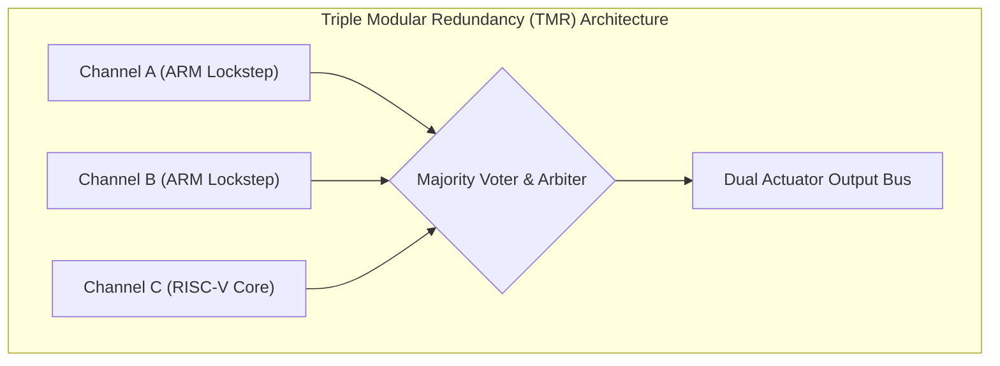

# Quantum Flight Management Computer V3

The **Quantum Flight Management Computer V3 (QFMC-V3)** is the central autonomous decision-making and autopilot brain deployed across the commercial drone fleet. Built to DO-178C Level-A airworthiness standards, it performs state estimation, sensor fusion, kinetic path replanning, and hardware health arbitrations at 400Hz.

---

## 1. Computing Architecture & Redundancy

| Parameter | Specification | Notes |
| :--- | :--- | :--- |
| **Processor Topology** | 2x ARM Cortex-R8 (Lockstep) + 1x RISC-V Safety Core | Heterogeneous fault tolerance |
| **AI Neural Accelerator** | Dual 32 TOPS Edge-TPU | Real-time object classification |
| **Sensor Update Loop** | 400 Hz | IMU, Barometric, Magnetometer |
| **Perception Refresh** | 60 Hz | 3D Point Cloud from LiDAR & Vision |
| **Power Consumption** | 24.5 W | Active compute with neural inference |

---

## 2. Integrated Sensor Interfaces

The QFMC-V3 continuously fuses input streams from primary navigational hardware:
- **Centimetric Positioning**: Differential GNSS position feeds via [Centimetric RTK-GPS Positioning Module](../navigation/rtk-gps-positioning-module.md).
- **Proximity & Airspace Scanning**: Active 360-degree point clouds from the [Solid-State LiDAR Collision Avoidance Array](../navigation/lidar-collision-avoidance-array.md).
- **Ground Texture Tracking**: Micro-hover stability via [High-Speed Optical Flow & Terrain Sensor](./optical-flow-terrain-sensor.md).

---

## 3. Operational Protocols Managed

1. **Autonomous Skyway Navigation**: Follows dynamic 4D waypoints specified under [BVLOS Low-Altitude Corridor Navigation Procedure](../../operations/flight-corridors/bvlos-corridor-nav-procedure.md).
2. **Containment & Geofencing**: Enforces micro-fencing thresholds defined in [Dynamic Geofence Breach Containment Protocol](../../safety/protocols/geofence-breach-containment.md).
3. **Emergency Disconnect**: Initiates motor shutdown and triggers the [Pyrotechnic Ballistic Parachute Recovery Failsafe](../../safety/protocols/ballistic-parachute-failsafe.md) if attitude deviation exceeds 45 degrees uncommanded.
