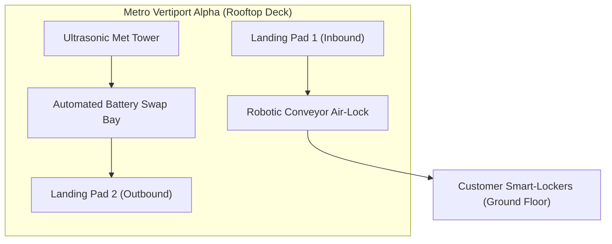

# Metro Vertiport Alpha (Downtown Hub)

**Metro Vertiport Alpha (Node ID: MVP-DOWNTOWN-04)** is a high-density rooftop micro-hub situated atop a 34-story commercial tower in the central business district. It serves as the primary terminus for on-demand e-commerce drops, urgent medical courier routes, and rapid turnaround parcel dispatches.

---

## 1. Physical Architecture & Urban Interface

| Infrastructure Unit | Specification |
| :--- | :--- |
| **Pads & Runways** | 4 Enclosed weatherproof landing pads with hydraulic capture funnels |
| **Turnaround Time** | < 120 seconds (touchdown to relaunch) |
| **Acoustic Barrier** | Micro-perforated acoustic deflectors reducing perimeter noise by 14 dB |
| **Docking Automation** | Internal robotic conveyor transferring parcels to building cargo lifts |

---

## 2. Supported Fleets & Precision Systems

The vertiport is the primary daily destination for the [SwiftPack X-4 Urban Delivery Drone](../../fleet/urban-courier/swiftpack-x4-delivery-uav.md).

Precision touchdown in turbulent rooftop eddy currents is accomplished via differential corrections streamed from the [Centimetric RTK-GPS Positioning Module](../../avionics/navigation/rtk-gps-positioning-module.md), backed up by the optical target tracking in the [High-Speed Optical Flow & Terrain Sensor](../../avionics/flight-control/optical-flow-terrain-sensor.md).

---

## 3. Battery Management & Weather Failsafes

Rapid turnarounds are sustained by an integrated [Autonomous Robotic Battery Swap Station (BSS-600)](../charging/automated-battery-swap-station.md).

Rooftop ultrasonic anemometers feed micro-wind shear data directly into the [Micro-Weather Routing & Divert Matrix](../../operations/flight-corridors/weather-divert-routing-matrix.md). If wind shear exceeds 24 knots, incoming flights hold at peripheral approach corridors or execute the [Dynamic Geofence Breach Containment Protocol](../../safety/protocols/geofence-breach-containment.md).
