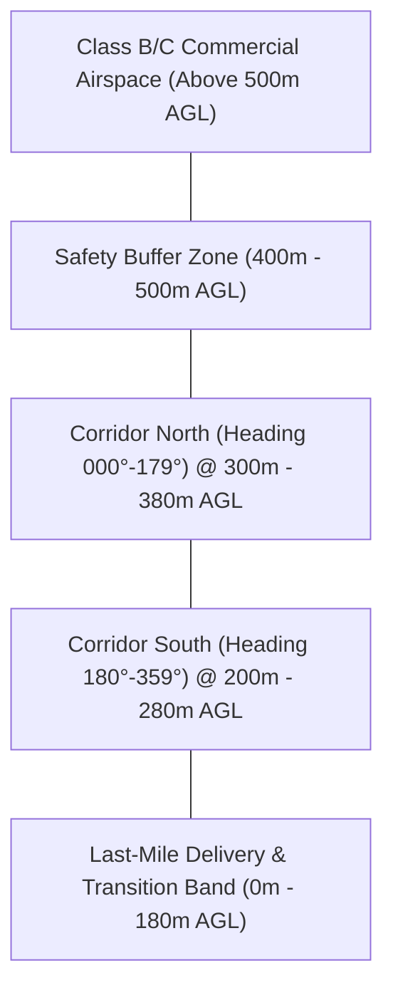

# BVLOS Low-Altitude Corridor Navigation Procedure

This Standard Operating Procedure (SOP-BVLOS-01) governs all autonomous Beyond-Visual-Line-of-Sight (BVLOS) flight sorties conducted in designated metropolitan and regional low-altitude airspace blocks.

---

## 1. 4D Airway Corridor Architecture

- **Lateral Tolerance**: ± 5.0 meters from virtual centerline.
- **Vertical Tolerance**: ± 3.0 meters from assigned flight level.
- **Time Slot Conformance**: Waypoints must be achieved within ± 4.0 seconds of assigned 4D trajectory schedule.

---

## 2. Pre-Flight Dispatch & Navigation Autopilot

1. **Strategic Deconfliction**: The ground UTM engine validates route availability 180 seconds prior to launch at [Skyport Central Air Freight Fulfillment Hub](../../facilities/hubs/skyport-central-fulfillment-hub.md).
2. **Trajectory Upload**: 4D mission polynomials are loaded securely via mTLS into the [Quantum Flight Management Computer V3](../../avionics/flight-control/quantum-flight-computer-v3.md).
3. **Regulatory Verification**: Compliance checks against all airspace authorizations under [FAA Part 108 BVLOS Regulatory Compliance Framework](../../safety/regulations/faa-part-108-bvlos-compliance.md).

---

## 3. Dynamic In-Flight Anomalies & Escalation

- **Micro-Weather Deviations**: If gust thresholds exceed safe limits, aircraft follow automated diversion paths defined in the [Micro-Weather Routing & Divert Matrix](./weather-divert-routing-matrix.md).
- **Corridor Excursions**: If an aircraft breaches the 5-meter lateral containment boundary, the autopilot automatically enters the [Dynamic Geofence Breach Containment Protocol](../../safety/protocols/geofence-breach-containment.md).
