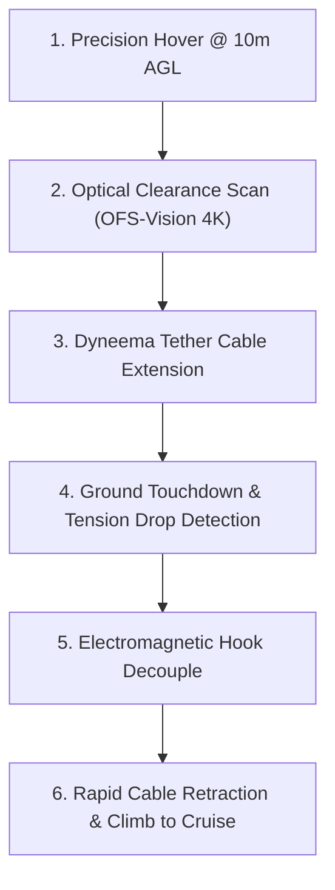

# Tethered Payload Winch & Delivery System

The **Tethered Payload Winch System (TPW-Gen2)** provides a contactless delivery mechanism that eliminates the safety and acoustic hazards of landing drones directly on residential ground surfaces. By lowering parcels via an ultra-high-molecular-weight polyethylene (Dyneema) tether, the aircraft maintains a safe hover altitude throughout the transaction.

---

## 1. Winch Specifications & Mechanics

| Subsystem Component | Specification | Description |
| :--- | :--- | :--- |
| **Tether Material** | Braided Dyneema SK78 | 1.1 mm diameter, 240 kg tensile rating |
| **Operational Length** | 15.0 meters | Max deployable cable extension |
| **Winch Descent Speed** | 1.8 m/s | Decelerating to 0.3 m/s at terminal 2 meters |
| **Auto-Release Mechanism** | Electromagnetic Smart Hook | Releases upon zero-tension touchdown verification |
| **Retraction Speed** | 2.5 m/s | High-speed unloaded rewind |

---

## 2. Integrated Delivery Sequence

The system is deployed primarily on the [SwiftPack X-4 Urban Delivery Drone](../../fleet/urban-courier/swiftpack-x4-delivery-uav.md).

Real-time altitude and ground clearance validation are governed by the [High-Speed Optical Flow & Terrain Sensor](../../avionics/flight-control/optical-flow-terrain-sensor.md).

---

## 3. Entanglement & Anti-Tamper Failsafe

If an external force (such as a tree branch or person) tugs on the cable with greater than 85 N of lateral or downward force:
- The winch activates an emergency pyrotechnic guillotine cutter in < 40 milliseconds.
- The aircraft immediately severs the tether and executes a vertical climb under [Dynamic Geofence Breach Containment Protocol](../../safety/protocols/geofence-breach-containment.md).
