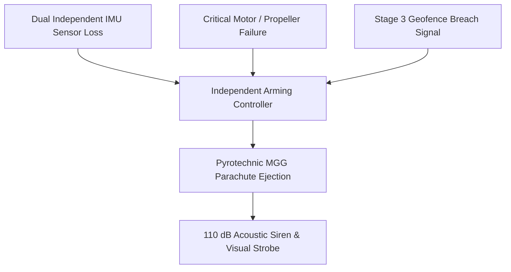

# Pyrotechnic Ballistic Parachute Recovery Failsafe

The **Pyrotechnic Ballistic Parachute Recovery Failsafe (PRS-800)** is an autonomous flight termination system (FTS) certified under ASTM F3322-18 standards. It guarantees safe descent and limits ground impact kinetic energy in the event of catastrophic structural, electrical, or aerodynamic failure.

---

## 1. Mechanical & Pyrotechnic Specifications

| Parameter | Specification | Notes |
| :--- | :--- | :--- |
| **Canopy Material** | Ripstop High-Tenacity Siliconized Nylon | Toroidal low-oscillation geometry |
| **Deployment Mechanism** | Micro-Gas Generator (MGG) Pyrotechnic Ejection | Zero reliance on airspeed or airflow |
| **Deployment Time** | < 320 milliseconds | Time to full canopy inflation |
| **Terminal Descent Rate** | 3.8 to 4.4 m/s | Under max MTOW load |
| **Ground Impact Energy** | < 38 Joules (< 28 ft-lbs) | Below human casualty threshold |
| **Minimum Effective Altitude** | 18.0 meters AGL | Rapid low-altitude deployment envelope |

---

## 2. Autonomous Triggering Matrix

The system is installed on heavy multirotors including the [SkyLift H-80 Heavy Cargo Drone](../../fleet/heavy-lift/skylift-h80-cargo-drone.md).

It is triggered autonomously upon unmitigated containment loss under [Dynamic Geofence Breach Containment Protocol](./geofence-breach-containment.md) or catastrophic battery thermal spikes detected in the [48V Solid-State Lithium Battery Pack](../../power/energy-storage/solid-state-lithium-pack-48v.md).

---

## 3. Regulatory Certification

Integration of the PRS-800 is a mandatory prerequisite for populated urban overflight operations as required by the [FAA Part 108 BVLOS Regulatory Compliance Framework](../regulations/faa-part-108-bvlos-compliance.md).
