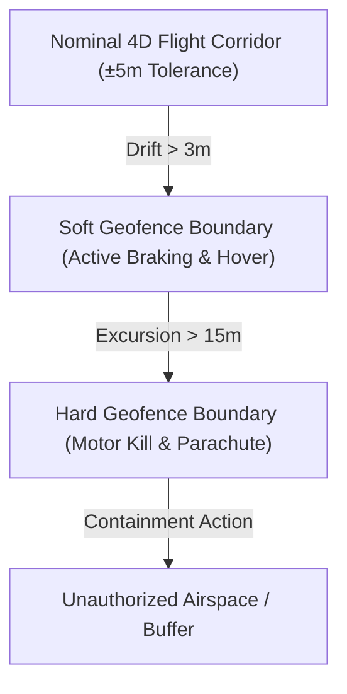

# Dynamic Geofence Breach Containment Protocol

The **Dynamic Geofence Breach Containment Protocol (SAF-PROT-04)** establishes deterministic, hard-real-time containment procedures to prevent unmanned aircraft from leaving authorized flight volumes or intruding into protected airspace.

---

## 1. Multi-Tiered Geofence Boundary Layers

---

## 2. Progressive Escalation Stages

| Stage | Trigger Condition | Automated Action | Latency |
| :--- | :--- | :--- | :--- |
| **Stage 1: Soft Warning** | Lateral drift > 3.0 m from airway center | Corrective vector torque command issued by [Quantum Flight Management Computer V3](../../avionics/flight-control/quantum-flight-computer-v3.md) | < 25 ms |
| **Stage 2: Active Containment** | Aircraft crosses Soft Boundary | Immediate kinetic braking, transition to fixed GPS hover, broadcast UTM squawk alert | < 100 ms |
| **Stage 3: Hard Breach Termination** | Aircraft penetrates Hard Boundary (>15m excursion) | Immediate rotor motor kill and deployment of [Pyrotechnic Ballistic Parachute Recovery Failsafe](./ballistic-parachute-failsafe.md) | < 350 ms |

---

## 3. Interaction with Flight Systems

This containment protocol actively governs operations across the entire airway infrastructure mapped in [BVLOS Low-Altitude Corridor Navigation Procedure](../../operations/flight-corridors/bvlos-corridor-nav-procedure.md).

All breach telemetry is archived synchronously for audit compliance under [FAA Part 108 BVLOS Regulatory Compliance Framework](../regulations/faa-part-108-bvlos-compliance.md).

## ## 1. Multi-Tiered Geofence Boundary Layers

## ## 2. Progressive Escalation Stages

| Stage | Trigger Condition | Automated Action | Latency |
| :--- | :--- | :--- | :--- |
| **Stage 1: Soft Warning** | Lateral drift > 3.0 m from airway center | Corrective vector torque command issued by [Quantum Flight Management Computer V3](../../avionics/flight-control/quantum-flight-computer-v3.md) | < 25 ms |
| **Stage 2: Active Containment** | Aircraft crosses Soft Boundary | Immediate kinetic braking, transition to fixed GPS hover, broadcast UTM squawk alert | < 100 ms |
| **Stage 3: Hard Breach Termination** | Aircraft penetrates Hard Boundary (>10m excursion) | Immediate rotor motor kill and deployment of [Pyrotechnic Ballistic Parachute Recovery Failsafe](./ballistic-parachute-failsafe.md) | < 350 ms |
