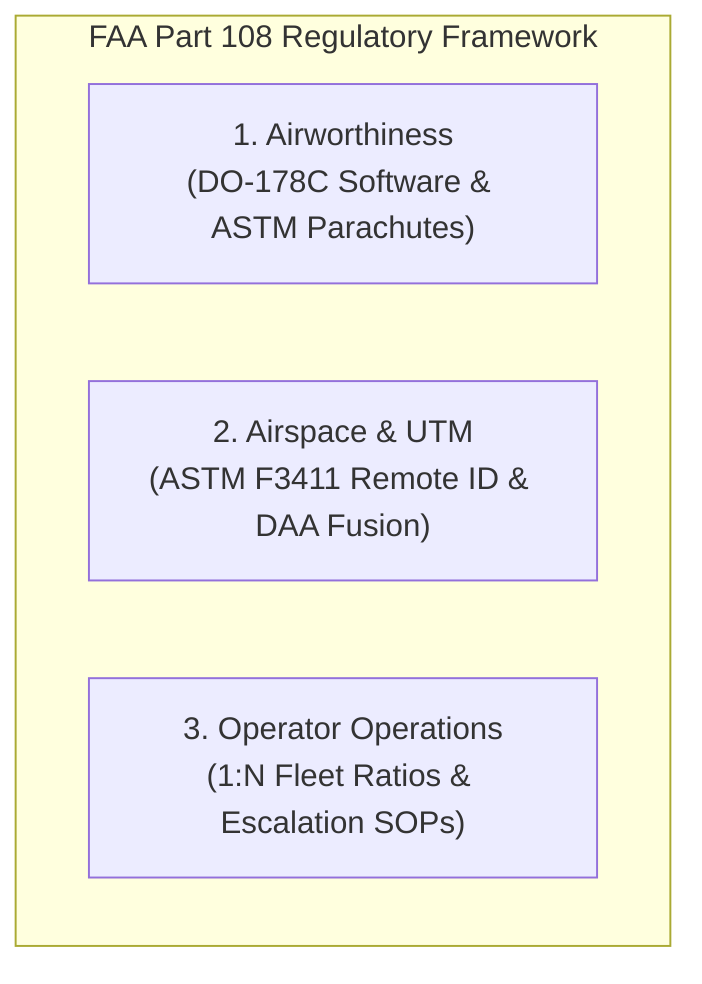

# FAA Part 108 BVLOS Regulatory Compliance Framework

The **FAA Part 108 Regulatory Framework** codifies the rules, certification baselines, and operational authorizations for routine commercial Beyond-Visual-Line-of-Sight (BVLOS) drone operations without individual visual observers.

---

## 1. Core Compliance Mandates

| Regulatory Pillar | Mandated Requirement | Reference Standard |
| :--- | :--- | :--- |
| **Detect-and-Avoid (DAA)** | Cooperative and non-cooperative target separation | ASTM F3442 / F3442M |
| **Ground Risk Mitigation** | Kinetic impact energy < 29 ft-lbs in population centers | ASTM F3322-18 Parachute Standard |
| **Remote ID & Telemetry** | Broadcast Remote ID at 1 Hz minimum | ASTM F3411-22a Standard |
| **Flight Planning** | 4D trajectory synchronization with third-party USS | FAA UTM ConOps v2.0 |

---

## 2. Operational Integration

All flights operating within controlled low-altitude corridors must maintain active conformance with [BVLOS Low-Altitude Corridor Navigation Procedure](../../operations/flight-corridors/bvlos-corridor-nav-procedure.md).

Safety equipment mandates require continuous readiness of the [Pyrotechnic Ballistic Parachute Recovery Failsafe](../protocols/ballistic-parachute-failsafe.md) and automated containment enforcement under the [Dynamic Geofence Breach Containment Protocol](../protocols/geofence-breach-containment.md).

---

## 3. Dispatch & Ground Station Certification

Master dispatch centers including the [Skyport Central Air Freight Fulfillment Hub](../../facilities/hubs/skyport-central-fulfillment-hub.md) are certified for 1:20 (one pilot supervising 20 autonomous UAVs) fleet operations, supported by automated failover systems and satellite-redundant datalinks.
