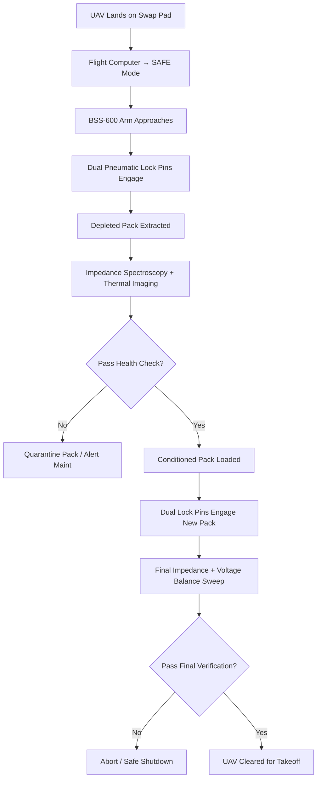

# Battery Swap Standard Operating Procedure (BSS-600)

**Document ID:** SOP-BSS-600-001
**Revision:** 1.0
**Effective Date:** 2026-09-28
**Classification:** Operations Critical — Safety Protocol

---

## 1. Purpose & Scope

This Standard Operating Procedure (SOP) defines the mandatory safety steps for **autonomous robotic battery swap operations** conducted at:

- **BSS-600 Autonomous Robotic Battery Swap Station** (full-scale depot units)
- **BSS-600 Compact Metro Vertiport Alpha** (single-bay urban rooftop units)

All personnel, automated systems, and remote supervisors involved in battery swap activities **must** comply with this procedure. Non-compliance constitutes a Safety Protocol Violation and triggers immediate operational hold.

**Applicable Battery Type:** [48V Solid-State Lithium Battery Pack (SSL-4864)](../../power/energy-storage/solid-state-lithium-pack-48v.md)

**Applicable UAV Platforms:** [SkyLift H-80 Heavy Cargo Drone](../../fleet/heavy-lift/skylift-h80-cargo-drone.md), [SwiftPack X-4 Urban Delivery Drone](../../fleet/urban-courier/swiftpack-x4-delivery-uav.md), and future compatible airframes.

---

## 2. References & Related Documents

| Document | Link |
|----------|------|
| 48V Solid-State Lithium Battery Pack Specification | [solid-state-lithium-pack-48v.md](../../power/energy-storage/solid-state-lithium-pack-48v.md) |
| Autonomous Robotic Battery Swap Station (BSS-600) | [automated-battery-swap-station.md](../../facilities/charging/automated-battery-swap-station.md) |
| Metro Vertiport Alpha Battery Swap Station (BSS-600 Compact) | [metro-vertiport-alpha-battery-swap-station.md](../../facilities/charging/metro-vertiport-alpha-battery-swap-station.md) |
| Pyrotechnic Ballistic Parachute Recovery Failsafe | [ballistic-parachute-failsafe.md](./ballistic-parachute-failsafe.md) |
| Dynamic Geofence Breach Containment Protocol | [geofence-breach-containment.md](./geofence-breach-containment.md) |
| FAA Part 108 BVLOS Regulatory Compliance Framework | [faa-part-108-bvlos-compliance.md](../regulations/faa-part-108-bvlos-compliance.md) |

---

## 3. Definitions & Key Terms

| Term | Definition |
|------|------------|
| **BSS-600** | Autonomous Robotic Battery Swap Station (6-axis arm, 16-slot magazine) |
| **BSS-600 Compact** | Single-bay variant for urban rooftop vertiports |
| **SSL-4864** | 48V Solid-State Lithium Battery Pack (350 Wh/kg, silicon-anode) |
| **SoC** | State of Charge (percentage of usable capacity) |
| **BMS** | Battery Management System (onboard CAN-bus telemetry) |
| **AC Impedance Spectroscopy** | High-frequency electrical test for cell health / dendrite detection |
| **Thermal Conditioning** | Active liquid cooling & Peltier heat-pump loop maintaining 28°C ± 2°C |
| **MTOW** | Maximum Takeoff Weight |
| **AGL** | Above Ground Level |

---

## 4. PPE & Equipment Requirements

| Requirement | Specification | Notes |
|-------------|---------------|-------|
| **Personnel PPE** | Arc-flash rated face shield, Class 0 insulated gloves, ESD-safe footwear | Required for any manual intervention |
| **Fire Suppression** | Class D lithium-metal extinguisher within 3 m of station | Verified monthly |
| **Thermal Imaging** | FLIR or equivalent (≥ 640 × 480, ±2°C accuracy) | Integrated in BSS-600 head; handheld backup required |
| **Gas Detection** | Multi-gas monitor (CO, H₂, HF, VOC) | Alarm threshold: CO > 25 ppm, HF > 3 ppm |
| **Isolation Tools** | Hot-stick (48 V rated), insulated torque wrench (0.2 mm tolerance) | Stored in station cabinet |
| **Emergency Stop** | Dual-channel E-stop (wired + wireless) | Tested before each shift |

---

## 5. Pre-Swap Safety Checklist

**All items must be verified before initiating any swap cycle.**

| # | Check Item | Pass/Fail | Verified By |
|---|------------|-----------|-------------|
| 1 | Station E-stop functional (wired + wireless) | ☐ |  |
| 2 | Thermal conditioning loop active (28°C ± 2°C confirmed) | ☐ |  |
| 3 | Magazine carousel indexed to correct conditioned slot | ☐ |  |
| 4 | Gas detectors online, zeroed, no active alarms | ☐ |  |
| 5 | Fire suppression system charged, inspection tag current | ☐ |  |
| 6 | UAV powered down, props secured, flight computer in SAFE mode | ☐ |  |
| 7 | BMS telemetry link established (CAN-bus heartbeat < 100 ms) | ☐ |  |
| 8 | No active TFR / geofence breach alerts for the vertiport | ☐ |  |
| 9 | Thermal imaging camera calibrated, lens clean | ☐ |  |
| 10 | Swap bay clearance zone (2 m radius) free of personnel & FOD | ☐ |  |

**IF ANY CHECK FAILS → DO NOT PROCEED. Log discrepancy and escalate to Shift Supervisor.**

---

## 6. Step-by-Step Swap Procedure

### 6.1 Automated Nominal Cycle (Standard Operation)



#### Detailed Steps

| Step | Action | Duration | Acceptance Criteria |
|------|--------|----------|---------------------|
| 1 | UAV auto-lands on swap pad; flight computer enters SAFE mode | — | Props stationary, telemetry confirms SAFE |
| 2 | BSS-600 six-axis arm homes to battery bay (±0.2 mm repeatability) | ~5 s | Arm position confirmed via encoder feedback |
| 3 | Dual pneumatic lock pins engage depleted pack | ~3 s | Both pins seated; proximity sensors HIGH |
| 4 | Robotic arm extracts depleted pack vertically | ~8 s | No lateral force > 5 N; smooth motion |
| 5 | **Immediate health scan:** AC impedance spectroscopy (1 kHz – 1 MHz) + thermal imaging | ~12 s | All cell impedances within ±5% of baseline; max cell ΔT < 3°C |
| 6 | **Decision Gate:** If impedance spike > 15% or hotspot > 35°C → **QUARANTINE** (see §7) | — | Automated flag in station log |
| 7 | Depleted pack placed in conditioning rack; liquid cooling + Peltier loop engaged | — | Pack temp trends to 28°C ± 2°C within 3 min |
| 8 | Magazine carousel indexes to next 100% SoC conditioned pack | ~6 s | Slot verified via RFID + BMS handshake |
| 9 | New pack inserted; dual pneumatic lock pins engage | ~3 s | Both pins seated; electrical continuity confirmed |
| 10 | **Final verification sweep:** Full impedance spectroscopy + cell voltage balance check | ~15 s | All cells 4.15 V ± 0.02 V; impedance within spec |
| 11 | **Decision Gate:** If any cell out of balance > 0.05 V → **ABORT** (see §7) | — | Automated hold; UAV remains in SAFE |
| 12 | Station signals swap complete; UAV flight computer released for takeoff | ~2 s | Telemetry shows 100% SoC, green BMS status |

**Total Nominal Cycle Target: ≤ 85 seconds (BSS-600) / ≤ 95 seconds (BSS-600 Compact)**

---

### 6.2 Manual Override Procedure (Maintenance / Fault Recovery)

> **ONLY** authorized Maintenance Technicians (Level 2+) may execute manual override.

1. Press **E-STOP** (wired) → station enters SAFE HOLD.
2. Don full PPE (arc-flash shield, Class 0 gloves).
3. Verify zero voltage at pack terminals with calibrated multimeter.
4. Use hot-stick to manually disengage pneumatic pins (override lever inside cabinet).
5. Remove pack using insulated lift fixture (18.2 kg rated).
6. Perform manual impedance spectroscopy with handheld tester.
7. Install replacement pack using same fixture; torque pins to 1.2 N·m.
8. Re-enable station; run **full nominal cycle verification** (Steps 5–11) before releasing UAV.
9. Log all manual actions in Station Maintenance Log with technician ID, timestamp, and reason.

---

## 7. Emergency Procedures

### 7.1 Thermal Runaway / Hotspot Detected During Swap

| Trigger | Immediate Action |
|---------|------------------|
| Any cell > 65°C (BMS alert) | 1. Station auto-triggers E-STOP<br>2. Gas detectors sample for HF/CO<br>3. If HF > 3 ppm or CO > 50 ppm → **EVACUATE 10 m radius**<br>4. Deploy Class D extinguisher ONLY if flame visible<br>5. Notify Shift Supervisor & Fire Safety Officer |
| Thermal imaging hotspot > 35°C on extracted pack | 1. Pack auto-routed to **Quarantine Bay** (dedicated fire-rated locker)<br>2. Quarantine bay activates independent cooling + gas venting<br>3. Pack held 60 min under observation before disposition |

### 7.2 Mechanical Jam / Arm Fault

| Trigger | Immediate Action |
|---------|------------------|
| Arm position error > 1 mm or force > 20 N | 1. Station halts motion, holds position<br>2. E-STOP engaged automatically<br>3. Technician assesses with PPE; manual override per §6.2 if safe |
| Lock pin failure (single pin) | 1. Cycle aborted; pack held by arm<br>2. Second pin status verified<br>3. If both pins failed → pack lowered to quarantine tray |

### 7.3 Electrical Fault / Arc Event

1. **E-STOP** → kills all station power (including robotic arm).
2. **Do NOT touch** UAV or pack until zero-voltage verified.
3. Gas detectors monitored for 5 min.
4. Full electrical inspection by qualified electrician before restart.

### 7.4 UAV Flight Emergency Post-Swap

If UAV exhibits abnormal behavior after swap clearance:

- **BMS thermal spike > 65°C** → UAV autonomous corridor exit + [Pyrotechnic Ballistic Parachute Recovery Failsafe](./ballistic-parachute-failsafe.md) deployment
- **Geofence breach** → [Dynamic Geofence Breach Containment Protocol](./geofence-breach-containment.md) Stage 3 triggers parachute
- **All events** logged to UTM & station audit trail per FAA Part 108

---

## 8. Post-Swap Verification

| Check | Method | Pass Criteria |
|-------|--------|---------------|
| UAV BMS telemetry | CAN-bus heartbeat + cell voltages | All cells 4.15 V ± 0.02 V, temp 25–35°C |
| Station thermal log | Last 10 min trend | All magazine slots 28°C ± 2°C |
| Swap cycle time | Timestamp log | ≤ 85 s (BSS-600) / ≤ 95 s (Compact) |
| Impedance baseline | Compare to pack historical baseline | ΔZ < 5% per cell |
| Gas detector logs | 5 min post-swap | No alarms |

**IF ANY POST-SWAP CHECK FAILS → UAV HELD. Do not launch. Escalate to Maintenance.**

---

## 9. Documentation & Logging

All swap events are automatically recorded in the **Station Audit Database** with the following fields:

- Timestamp (UTC, ISO 8601)
- UAV tail number & flight ID
- Pack serial numbers (removed / installed)
- Cycle duration (ms)
- Impedance spectroscopy results (full spectrum CSV)
- Thermal imaging max / min / delta
- BMS SoC & cell voltages (pre & post)
- Operator / Supervisor ID (if manual intervention)
- Disposition code: `NOMINAL`, `QUARANTINE`, `ABORT`, `MANUAL_OVERRIDE`

**Retention:** 7 years (regulatory). **Backup:** Daily off-site replication.

---

## 10. Training & Qualification

| Role | Minimum Training | Requalification |
|------|------------------|-----------------|
| Remote Supervisor | SOP-BSS-600-001 classroom (4 hrs) + 5 supervised swaps | Annual |
| Maintenance Technician L2 | Above + Manual Override Lab (8 hrs) + HV safety cert | Annual |
| Maintenance Technician L3 (Fault Recovery) | L2 + Thermal Runaway Drill + Gas Detection | Semi-annual |

---

## 11. Decision Log & Revision History

| Rev | Date | Author | Change Summary |
|-----|------|--------|----------------|
| 1.0 | 2026-09-28 | Safety Engineering | Initial release. Consolidates BSS-600 prototype thermal tuning data (28°C ± 2°C setpoint per 2026-08-28 Decision Log) and Metro Compact variant procedures. |

---

## 12. Appendices

### Appendix A: Thermal Operating Threshold Decision Context (from BSS-600 Design)

> **Decision Date:** 2026-08-28
> **Decision:** Raise thermal operating threshold from 24°C to 28°C to reduce chiller power consumption during peak summer periods.
> **Rationale:** Solid-state lithium chemistries tolerate higher surface temperatures; process studies show acceptable calendar life degradation below 30°C.
> **Risk Mitigation:** Tighter cell-level monitoring + automated dynamic throttling if pack temp > 32°C.
> **Status:** Active tuning protocol deployed and operational.

### Appendix B: Quarantine Bay Layout

```
[Swap Pad] — 2 m — [BSS-600 Arm] — 1 m — [Conditioning Rack]
                                             |
                                             v
                                      [Quarantine Bay] (Fire-rated, independent cooling, gas vent)
```

---

**END OF DOCUMENT — SOP-BSS-600-001 REV 1.0**
