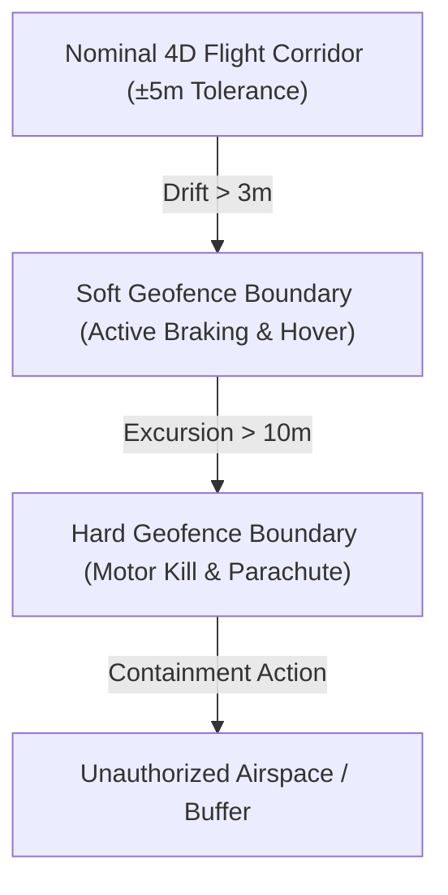

# Dynamic Geofence Breach Containment Protocol

The **Dynamic Geofence Breach Containment Protocol (SAF-PROT-04)** establishes deterministic, hard-real-time containment procedures to prevent unmanned aircraft from leaving authorized flight volumes or intruding into protected airspace.

---

## 1. Multi-Tiered Geofence Boundary Layers

---

## 2. Progressive Escalation Stages

| Stage | Trigger Condition | Automated Action | Latency |
| :--- | :--- | :--- | :--- |
| **Stage 1: Soft Warning** | Lateral drift > 3.0 m from airway center | Corrective vector torque command issued by [Quantum Flight Management Computer V3](../../avionics/flight-control/quantum-flight-computer-v3.md) | < 25 ms |
| **Stage 2: Active Containment** | Aircraft crosses Soft Boundary | Immediate kinetic braking, transition to fixed GPS hover, broadcast UTM squawk alert | < 100 ms |
| **Stage 3: Hard Breach Termination** | Aircraft penetrates Hard Boundary (>10m excursion) | Immediate rotor motor kill and deployment of [Pyrotechnic Ballistic Parachute Recovery Failsafe](./ballistic-parachute-failsafe.md) | < 350 ms |

---

## 3. Interaction with Flight Systems

This containment protocol actively governs operations across the entire airway infrastructure mapped in [BVLOS Low-Altitude Corridor Navigation Procedure](../../operations/flight-corridors/bvlos-corridor-nav-procedure.md).

All breach telemetry is archived synchronously for audit compliance under [FAA Part 108 BVLOS Regulatory Compliance Framework](../regulations/faa-part-108-bvlos-compliance.md).

---

## 4. Decision Log

### 2026-08-20: Hard Geofence Excursion Limit Reduction (15m → 10m)

**Decision Context**
Following a recent safety review, the hard geofence breach excursion threshold was reduced from 15 meters to 10 meters. This change tightens the containment envelope for all BVLOS corridor operations governed under this protocol.

**Rationale & Trade-offs**
- **Pro**: Reduces the maximum unauthorized airspace penetration from 15m to 10m, providing a larger safety margin before the aircraft enters protected or unauthorized volumes.
- **Pro**: Earlier motor kill and parachute deployment reduces kinetic impact energy upon ground contact, improving public safety outcomes.
- **Con**: A tighter hard boundary increases the probability of Stage 3 activations during severe wind shear or turbulence events, potentially leading to more parachute deployments than strictly necessary.
- **Con**: Shortened soft-to-hard buffer (now 7m between soft boundary at 3m and hard boundary at 10m) reduces the operational window for Stage 2 active containment to recover the aircraft.

**Alternatives Considered**
- *Maintain 15m*: Rejected — insufficient safety margin for high-density urban corridors.
- *Reduce to 5m*: Rejected — would trigger hard breach almost immediately upon soft boundary crossing, eliminating Stage 2 recovery entirely and causing excessive parachute deployments.
- *Dynamic threshold based on wind speed*: Deferred — adds complexity to the real-time failsafe logic and was deemed out of scope for this review cycle.

**Implementation Notes**
- The change is effective immediately across all flight corridors mapped in [BVLOS Low-Altitude Corridor Navigation Procedure](../../operations/flight-corridors/bvlos-corridor-nav-procedure.md).
- All [Quantum Flight Management Computer V3](../../avionics/flight-control/quantum-flight-computer-v3.md) units must have firmware updated to reflect the 10m threshold.
- Telemetry archives under [FAA Part 108 BVLOS Regulatory Compliance Framework](../regulations/faa-part-108-bvlos-compliance.md) will capture the new threshold for audit trail continuity.
